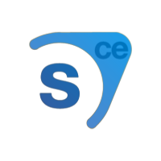

  

 <a href=""></a>
<a href=""></a>

# Source SDK 2013 Community Edition Gamma

# Short info
This fork main idea was to remove some junky `PS3`, `XBOX` code from the **Source SDK 2013 Community Edition Gamma**.

# Requirements 
To be able to use Source 2013 CE you will need to download **Visual Studio 2022** and install:
* MSVC v143 - VS 2022 C++ x64/x86 build tools
* C++ MFC Library for latest v143 build tools (x86 and x64)
* Windows 11 SDK (10.0.22000.0)

As of July 2023, CE has been tested on Visual Studio 2022 with the latest versions of the requirements listed above. So if desired you can use that instead.

Credits for 2019 support: momentum mod, Brae, and Anthonypython
Credits for CI: TF2Vintage, Deathreus, Dio, Anthonypython
Credits for SDK2013CE :blue_heart:: [@Nbc66](https://github.com/Nbc66) & [@GamerDude27](https://github.com/GamerDude27)
